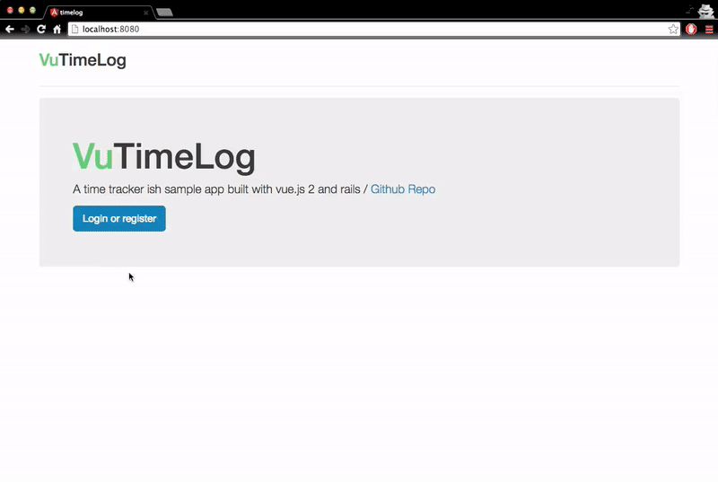

# VuTimeLog



VuTimeLog is a timetracker ish sample app built with the following tools to learn some vue.js

- [vue.js 2](https://github.com/vuejs/vue)
- [vuex](https://github.com/vuejs/vuex)
- [vue-router](https://github.com/vuejs/vue-router)
- [rails 5](https://github.com/rails/rails)

## Setup

``` bash
npm install
npm run dev

# build for production with minification
npm run build
```

api

```bash
cd backend
bundle
rake db:create
rake db:migrate
rake db:seed # check db/seeds.rb
rails s
```

update `default_url_options` in `application.rb` for prod
